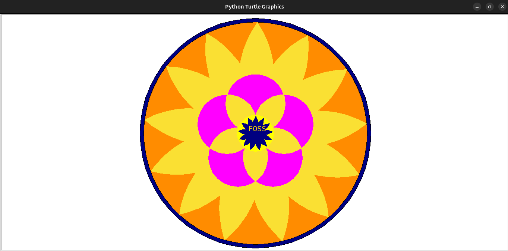

<h1 align=center>CODE A POOKALAM</h1>

> This is a simple code for code a pookalam 2k24

Hello, I'm Alestor Aldous
First year Computer Science Student from at [Government Model Engineering College
](https://www.mec.ac.in/)

This is my submission for Code_A_Pookalam, done using turtle library of Python

Libraries used: Math, Turtle

# Screenshots    

## Author

👤 **Alestor Aldous**

- Twitter: [@alestor123](https://twitter.com/alestor123)
- Github: [@alestor123](https://github.com/alestor123)

## 📝 License
> MIT

Copyright © 2022 [Alestor Aldous](https://github.com/alestor123). 
